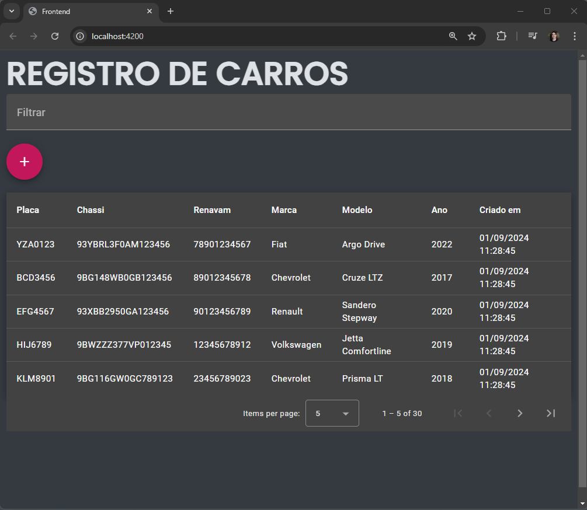
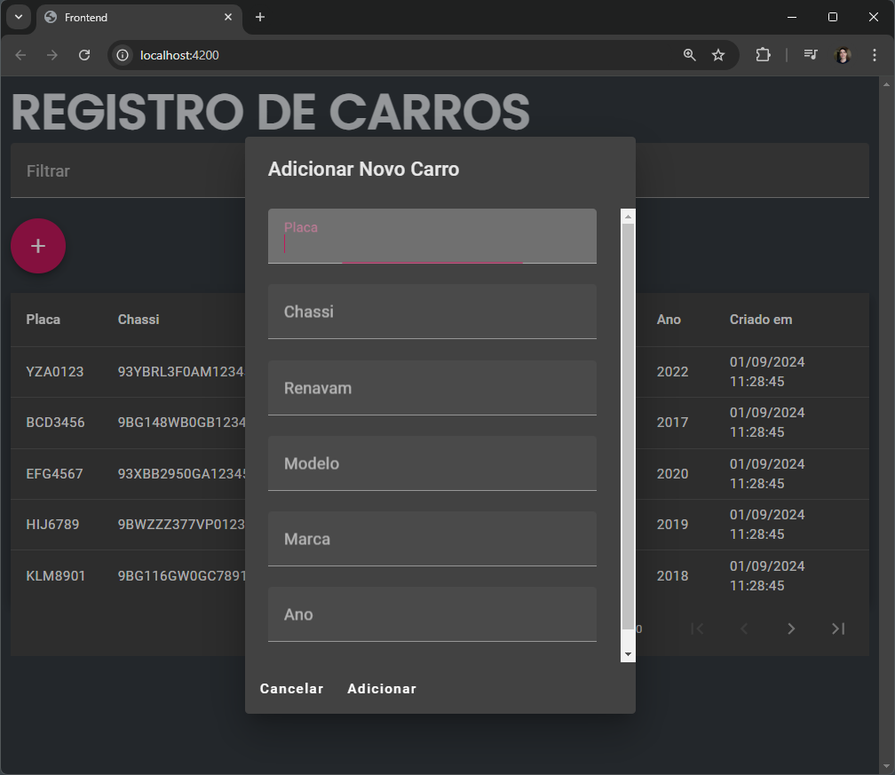
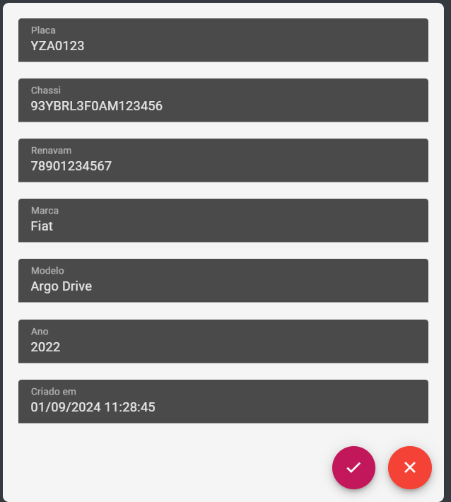
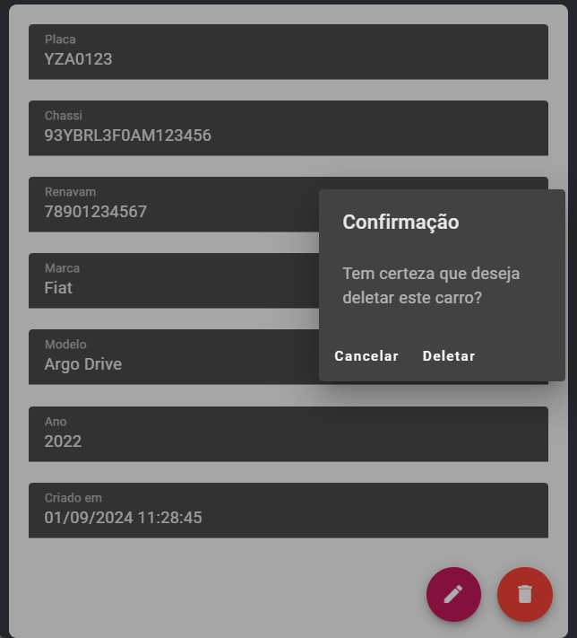

# project-cars

# Backend

Este projeto consiste em uma aplicação Node.js desenvolvida com TypeScript, focada em manipulação de registros de carros. O projeto utiliza Mocha para testar todos os endpoints.

A aplicação utiliza um banco de dados local SQLite, que já está incluído no projeto e pré-populado com dados de exemplo. Por questões de simplicidade e para demonstrar proficiência em SQL, optei por não utilizar um ORM como o Sequelize, apesar de ter experiência com ele. Todas as operações com o banco de dados são feitas diretamente via queries SQL.

## Como Rodar o Projeto

Para iniciar a aplicação:

```bash
npm start
```
Para rodar os testes:

```bash
npm test
```

## Endpoints

### 1. Listar todos os registros de carros com paginação

Este endpoint retorna todos os registros de carros, com suporte a paginação.

**GET** - `http://localhost:3001/api/v1/carros`

Para utilizar a paginação, passe os parâmetros `page` e `limit`:

**GET** - `http://localhost:3001/api/v1/carros?page=1&limit=10`

A resposta incluirá um atributo `hasNext` que indica se existe uma próxima página disponível.

### 2. Obter um registro específico de carro

Este endpoint retorna os detalhes de um registro de carro específico, identificado pelo seu `id`.

**GET** - `http://localhost:3001/api/v1/carros/{id}`

### 3. Criar um novo registro de carro

Este endpoint permite a criação de um novo registro de carro.

**POST** - `http://localhost:3001/api/v1/carros`

### 4. Atualizar todos os dados de um registro de carro

Este endpoint permite a atualização completa de todos os campos de um registro de carro existente.

**PUT** - `http://localhost:3001/api/v1/carros/{id}`

### 5. Atualizar campos específicos de um registro de carro

Este endpoint permite a atualização parcial de um registro de carro, alterando apenas os campos fornecidos na requisição.

**PATCH** - `http://localhost:3001/api/v1/carros/{id}`

### 6. Deletar um registro específico de carro

Este endpoint permite a exclusão de um registro de carro identificado pelo seu `id`.

**DELETE** - `http://localhost:3001/api/v1/carros/{id}`

# Frontend

Este projeto frontend foi desenvolvido em Angular 16 e fornece uma interface intuitiva para a gestão de registros de carros. A aplicação permite ao usuário visualizar a lista completa de registros, selecionar um registro específico para edição ou exclusão, e adicionar novos registros. 

Toda a interação com os dados é feita através de chamadas aos endpoints REST do projeto backend, garantindo uma integração eficiente entre as camadas da aplicação.

##Lista dos registros:##


##Criação de registro:##


##Edição de registro:##


##Exclusão de registro:##

